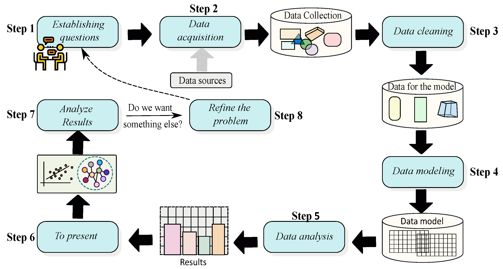
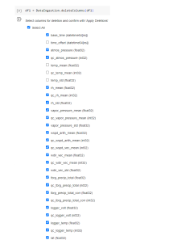
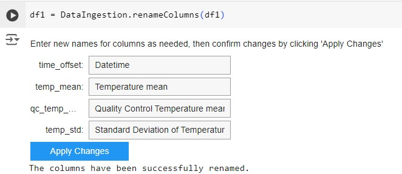
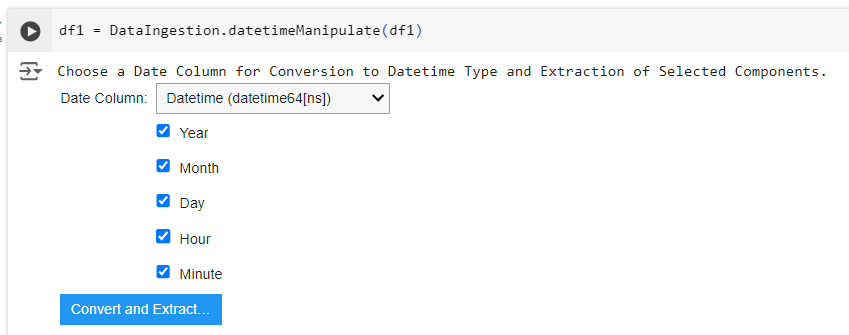
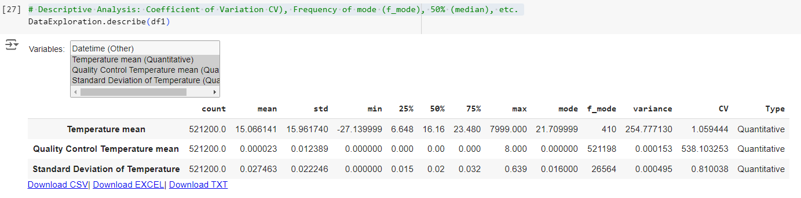
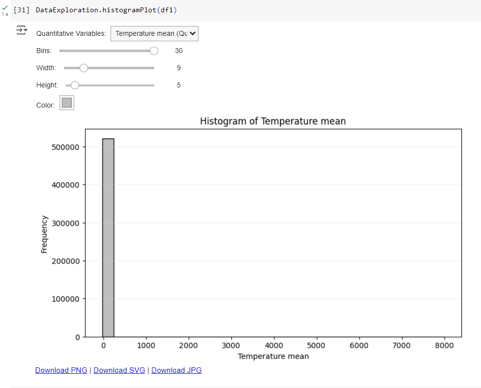
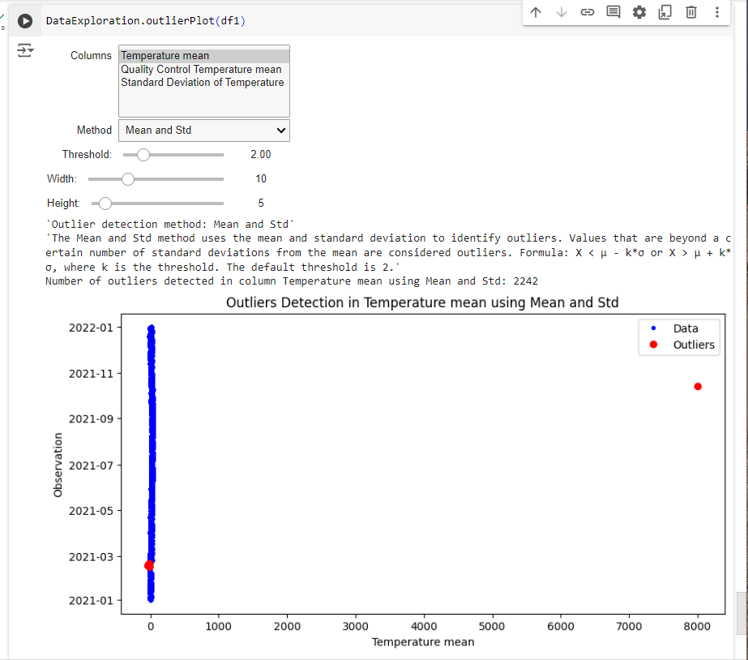
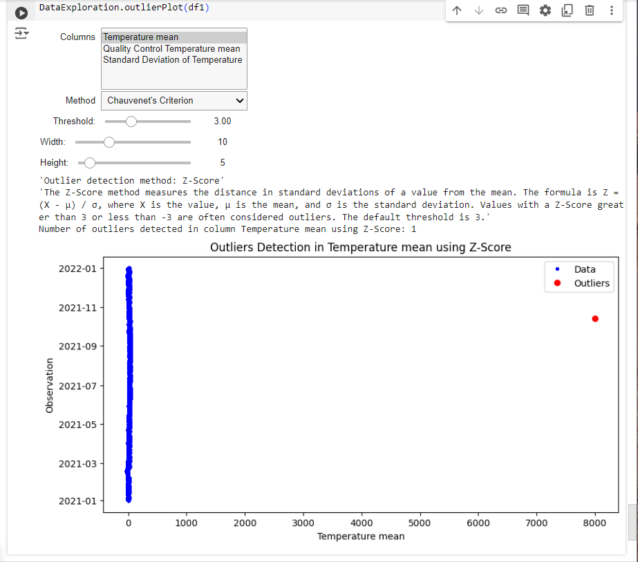

# DataVizExplorer: Python library for Data Analysis life cycle 

[](https://www.python.org/downloads/) [](https://github.com/rosaencinas/DataVizExplorer/blob/master/LICENSE)                                                                         
**DataVizExplorer** is a Python library designed to help data analysis by guiding users through the steps of the Data Science methodology in an easy, simple, and interactive way. It is compatible with Jupyter notebooks and the IPython kernel, providing an intuitive and efficient data analysis experience.

## Key Features
- **Interactivity:** Enables dynamic and interactive data analysis, perfect for real-time exploration and visualization.
- **Ease of Use:** User-friendly interface that simplifies the analysis process, even for Data Science beginners.
- **Compatibility:** Seamlessly integrates with Jupyter notebooks and the IPython kernel, leveraging the full potential of these platforms for interactive development.
- **Data Science Methodology:** Comprehensive support for the main steps of the Data Science methodology, including data cleaning, exploration, visualization, and modeling (See Figure 1).

[](https://www.python.org/downloads/) 
<p align="center">
  <em>Figure 1: Data Science Methodology as Data Analysis Life Cycle [1]</em>
</p>

---

> **NOTE:** Launching soon!
> We are excited to announce that DataVizExplorer will be launching very soon! 
## Installation

To install DataVizExplorer once it's available, use the following command:

```bash
pip install DataVisExplorer
```
With `Conda`

```bash
conda install -c conda-forge DataVisExplorer
```
## Usage

```py
from DataVizExplorer import DataIngestion
from DataVizExplorer import DataExploration
from DataVizExplorer import DataVisualization
from DataVizExplorer import DataInterpolation
from DataVizExplorer import SupervisedLeaning
from DataVizExplorer import UnsupervisedLearning
```

```bash
$ python -m DataVizExplorer
#or
$ DataVizExplorer
```
---
### Case study: Atmospheric Radiation Measurement (ARM) dataset using NetCDF file

#### Step 1: Stablishing Questions

How do you predict the temperature of a weather station based on data from another nearby station?

#### Step 2: Data Adquisition
##### 2.1. Data Retrieve
The data retrieved consists of 741 files (125.93 MBytes). It covers the following
datastreams:
  - sgpmetE32.b1
  - sgpmetE33.b1
  
* Atmospheric Radiation Measurement (ARM) user facility. 2011. Surface Meteorological Instrumentation (MET). 2021-01-01 to 2021-07-16, Southern Great Plains (SGP) Medford, OK (Extended) (E32).  Compiled by J. Kyrouac, Y. Shi and M. Tuftedal. ARM Data Center. Data set accessed 2024-02-16 at http://dx.doi.org/10.5439/1786358.

* Atmospheric Radiation Measurement (ARM) user facility. 2011. Surface Meteorological Instrumentation (MET). 2021-01-01 to 2021-06-20, Southern Great Plains (SGP) Newkirk, OK (Extended) (E33).  Compiled by J. Kyrouac, Y. Shi and M. Tuftedal. ARM Data Center. Data set accessed 2024-02-16 at http://dx.doi.org/10.5439/1786358.  

##### 2.2. Data Ingestion

##### 2.2.1. Importing Libraries

```py
# Importing our library to Data Ingestion process
from DataVizExplorer import DataIngestion
```

```py
# Import this library to access datasets stored in Google Drive
from google.colab import drive
# Mount Google Drive to the Colab environment
drive.mount('/content/drive/')
```
##### 2.2.2. Setting Global Variables
```py
# Setting Global Variables
path = '/content/drive/MyDrive/ARM Case Study/' # Main path
file1 = 'sgpmetE32.b1.2021.cdf' # Fist dataset
file2 = 'sgpmetE33.b1.2021.cdf' # Second dataset
```
##### 2.2.3. Opening Data
Use this function `loadData()` to open NetCDF files (a standard file format in environmental studies for storing multi-dimensional scientific data) as well as other common file formats (CSV, Excel, TXT, etc.)

```py
# Opening Dataset
df1 = DataIngestion.loadData(path, file1)
df2 = DataIngestion.loadData(path, file2)
```

##### 2.2.2. Transforming Data
In this step, we perform the following operations:

1. Column Removal
2. Column Relabeling
3. Column Type Data Issues Detection (Column Convention Data Type Issues Detection)
4. Column Replace Value
5. Column Data Type Convertion
6. DateTime Manipulation (Formatting DateTime and Extracting DateTime Components)
7. Duplicate a Column

In this case, we demonstrate only the necessary operations for this case study.

###### 2.2.2.1. Deleting Unnecessary Columns
Use the `deleteColumns()` function to interactively view the variables in the dataset and mark those that are not needed for deletion


```py
# Column Removal (See Figure 2) 
df1 = DataIngestion.deleteColumns(df1)
```


<p align="center">
  <em>Figure 2: User interaction for the <span style="color: blue;">deleteColumns()</span> function, allowing users to mark columns that are not needed for the analysis. </em>
</p>

```py
# Remove unnecessary columns from df2 using the same process as df1 (refer to Figure 2)
df2 = DataIngestion.deleteColumns(df2)
```

###### 2.2.2.2. Renaming Columns
Use the `renameColumns()` function to interactively view and rename the variables in the dataset.

```py
# Column relabeling (See Figure 3) 
df1 = DataIngestion.renameColumns(df1)
```


<p align="center">
  <em>Figure 3: User interaction with the <span style="color: blue;">renameColumns()</span> function, allowing users to assign new names to columns.</em>
</p>


* The <span style="color: green;">Datetime</span> column represents the exact date and time when each observation was recorded, providing a temporal reference for the dataset.
* The <span style="color: green;">Temperature mean</span> column indicates the average temperature over a specified period, serving as a key metric for assessing climate conditions and trends.
* The <span style="color: green;">Quality Control Temperature mean</span> column reflects quality control information applied during data reprocessing. This standard, introduced by the ARM Data Center, indicates the reliability of the <span style="color: green;">Temperature mean</span> variable, ensuring its accuracy for climate analysis.

* The <span style="color: green;">Standard Deviation of Temperature</span> column measures the variability or dispersion of temperature readings around the mean, offering insights into the range and fluctuations of temperature values within the dataset.

```py
# Rename columns from df2 using the same process as df1 (refer to Figure 3)
df2 = DataIngestion.renameColumns(df2)
```

###### 2.2.2.3. Manipulating Date Time 

Use the `datetimeManipulate()` function to interactively perform date and time manipulation. This involves creating new columns from the components of the Datetime variable. This process enables the interactive use of visual tools during the data visualization step, enhancing the clarity and effectiveness of temporal data analysis.


```py
# Datetime column manipulate (See Figure 4) 
df1 = DataIngestion.datetimeManipulate(df1)
```


<p align="center">
<em>Figure 4: User interaction with the <span style="color: blue;">datetimeManipulate()</span> function, allowing users to create new columns from the components of the Datetime variable.</em>
</p>


```py
# Manipulate datetime columns in df2 using the same process as for df1 (refer to Figure 4)
df2 = DataIngestion.datetimeManipulate(df2)
```


#### Step 3: Data Cleaning
##### 3.1. Importing Data Exploration module
```py
# Importing our library to Data Exploration process
from DataVizExplorer import DataExploration
```

##### 3.2. Data Exploration
We employ various <span style="color: skyblue;">Data Exploration</span> techniques to ensure the quality and integrity of the dataset. Although the ARM Dataset is already clean, we demonstrate these techniques to provide more information about our dataset:
- Show Descriptive Statistics
- Show Frequency Distribution
  - Frequency Table for Qualitative Variables (Categorical Variables)
  - Bar and Pie Frequency Plot for Qualitative Variables (Categorical Variables)
  - Histogram for Quantitative Variables (Numerical Variables)
 
- Show Missing Data
- Show Outlier Detection
- Show Occurrence
- Show Interactions
- Show Correlations
- Show Hypothesis Testing
- Show ANOVA (Analysis of Variance)
- And more
- 
###### 3.2.1. Show Descriptive Statistics
Use the `describe()` function to interactively select variables and display all descriptive statistics information (See Figure 5).


```py
# Descriptive Analysis: Coefficient of Variation CV), Frequency of mode (f_mode), 50% (median), etc.  (See Figure 5) 
DataExploration.describe(df1)
```


<p align="center">
<em>Figure 5: User interaction with the <span style="color: blue;">DataExploration()</span> function, allowing users to select qualitative and quantitative variables to display descriptive statistics. Note that there are also options to download this information in various formats.</em>
</p>


###### 3.2.2. Histogram for Quantitative Variables (Numerical Variables)
Use the `histogramPlot()` function to interactively visualize the data for the selected variable (See Figure 6). Note that there is an issue with the Temperature mean, as there appears to be a value exceeding 8000 degrees.


```py
## See Figure 6
DataExploration.histogramPlot(df1)
```

<p align="center">
<em>Figure 6: User interaction with the <span style="color: blue;">histogramPlot()</span> function, allowing users to select quantitative variables to display a histogram plot. Note the available sliders and color options to adjust the figure's width, height, and color. Finally, there are options to download this plot in various formats.</em>
</p>


###### 3.2.3. Visualize outlier

Use the `outlierPlot()` function to interactively visualize the outlier for the selected variable (See Figure 7 and 8). Note that there is an issue with the Temperature mean, as there appears to be a value exceeding 8000 degrees.


```py
## Selecting Mean-and-Std and Chauvenet's Criterion Methods (See Figure 7 and 8)
DataExploration.outlierPlot(df1)
```

<p align="center">
<em>Figure 7: User interaction with the <span style="color: blue;">outlierPlot()</span> function, allowing users to select quantitative variables to display a plot highlighting outliers using a specified method. According to the Mean and Standard Deviation method, there are 2242 outliers, including a value exceeding 8000 degrees.</em>
</p>



<p align="center">
<em>Figure 8: User interaction with the <span style="color: blue;">outlierPlot()</span> function, allowing users to select quantitative variables to display a plot highlighting outliers using a specified method. According to the Chauvenet's Criterion method, there is only one outlier with a value exceeding 8000 degrees.</em>
</p>

The methods used in this step to identify outliers include statistical techniques such as the Interquartile Range (IQR), Z-Score, Mean and Standard Deviation, Box-plot, and Chauvenet's Criterion.


##### 3.3. Data Visualization 
We can leverage specific data visualization functions to more effectively visualize, explore, and make decisions regarding data cleaning operations.

###### 3.2.1. Importing Data Visualization module
```py
# Importing our library to Data Visualization process
from DataVizExplorer import DataVisualization
```
###### 3.2.2. Time Series Visualization

> **NOTE:** Launching soon!
> We are excited to announce that DataVizExplorer will be launching very soon! 
#### Authors

 - Rosa Virginia Encinas Quille <sup>1,2</sup> <a href="https://orcid.org/0000-0001-9166-1741"></a>
- Felipe Valencia de Almeida <sup>2</sup> <a href="https://orcid.org/0000-0003-2031-6443"></a>
- Suzanne Lorraine Allard <sup>3</sup> <a href="https://orcid.org/0000-0001-9421-3848"></a>
- Pedro Luiz Pizzigatti Corrêa <sup>1,2</sup> <a href="https://orcid.org/0000-0002-8743-4244"></a>
- Giri Prakash <sup>4</sup> <a href="https://orcid.org/0000-0002-2590-5848"></a>

<sup>1</sup> School of Arts, Sciences and Humanities, University of São Paulo, Rua Arlindo Béttio, 1000-Ermelino Matarazzo, São Paulo 03828-000, Brazil

<sup>2</sup> Polytechnic School, University of São Paulo, Av. Prof. Luciano Gualberto, 380-Butantã, São Paulo 05508-010, Brazil

<sup>3</sup> University of Tennessee at Knoxville, Center for Information and Communication Studies, 1345 Circle Park Drive, Suite 420, Knoxville, Tennessee, 37996, United States

<sup>4</sup> Environmental Sciences Division, Oak Ridge National Laboratory, 1 Bethel Valley Road, Oak Ridge, TN 37831, United States

## References

[1] Int. J. Environ. Res. Public Health 2023, 20(7), 5374; https://doi.org/10.3390/ijerph20075374
